# Daily Reflection Tree — Visual Diagram

```mermaid
flowchart TD
    START([🌙 START\nGood evening...]) --> A1_OPEN

    %% AXIS 1
    A1_OPEN{Q: Today's weather report?} --> A1_D1{Decision}

    A1_D1 -->|Clear / Mixed| A1_Q_AGENCY_HIGH{Q: What made it go well?}
    A1_D1 -->|Rough / Storm| A1_Q_AGENCY_LOW{Q: What was your instinct?}

    A1_Q_AGENCY_HIGH -->|Prepared / Flexible| A1_Q_CHOICE
    A1_Q_AGENCY_HIGH -->|Team / Luck| A1_Q_EXTERNAL_SOFT

    A1_Q_AGENCY_LOW -->|Find what I can control| A1_Q_CHOICE
    A1_Q_AGENCY_LOW -->|Wait / Others / Push alone| A1_Q_EXTERNAL_HARD

    A1_Q_CHOICE{Q: What drove your decision?} --> A1_R_INTERNAL[[📍 Reflection: You have agency]]
    A1_Q_EXTERNAL_SOFT{Q: Was outcome more in your hands?} --> A1_R_MIXED[[📍 Reflection: You had more say]]
    A1_Q_EXTERNAL_HARD{Q: What call did you make?} --> A1_R_EXTERNAL[[📍 Reflection: Rough day, still choices]]

    A1_R_INTERNAL --> BRIDGE_1_2
    A1_R_MIXED --> BRIDGE_1_2
    A1_R_EXTERNAL --> BRIDGE_1_2

    %% AXIS 2
    BRIDGE_1_2([🌉 Bridge: Now — what did you give?]) --> A2_OPEN

    A2_OPEN{Q: Biggest interaction today?} --> A2_D1{Decision}

    A2_D1 -->|Gave / Helped| A2_Q_CONTRIBUTION{Q: Nature of contribution?}
    A2_D1 -->|Unacknowledged / Just my part| A2_Q_ENTITLEMENT{Q: What feels most true?}

    A2_Q_CONTRIBUTION --> A2_Q_RECOGNITION{Q: Did you need recognition?}
    A2_Q_ENTITLEMENT --> A2_Q_GIVE{Q: When could you have given?}

    A2_Q_RECOGNITION -->|Giving was enough| A2_R_CONTRIBUTION_STRONG[[📍 Reflection: Giving without score]]
    A2_Q_RECOGNITION -->|Wanted notice| A2_R_CONTRIBUTION_MIXED[[📍 Reflection: Gave + wanted credit]]

    A2_Q_GIVE -->|Too stretched| A2_R_ENTITLEMENT_SOFT[[📍 Reflection: Constraint vs choice]]
    A2_Q_GIVE -->|Not my job / Didn't notice / Protected bandwidth| A2_R_ENTITLEMENT[[📍 Reflection: Invisible gap]]

    A2_R_CONTRIBUTION_STRONG --> BRIDGE_2_3
    A2_R_CONTRIBUTION_MIXED --> BRIDGE_2_3
    A2_R_ENTITLEMENT_SOFT --> BRIDGE_2_3
    A2_R_ENTITLEMENT --> BRIDGE_2_3

    %% AXIS 3
    BRIDGE_2_3([🌉 Bridge: Now — who else was in your day?]) --> A3_OPEN

    A3_OPEN{Q: Who came to mind during stress?} --> A3_D1{Decision}

    A3_D1 -->|Just me| A3_Q_SELFCENTRIC{Q: Who else was affected?}
    A3_D1 -->|Team / Colleague / Others| A3_Q_ALTROCENTRIC{Q: Did you act on that awareness?}

    A3_Q_SELFCENTRIC -->|Yes saw ripple / Probably| A3_R_EXPANDING[[📍 Reflection: Expanding lens]]
    A3_Q_SELFCENTRIC -->|Secondary / Self-contained| A3_R_NARROW[[📍 Reflection: Aperture habit]]

    A3_Q_ALTROCENTRIC -->|Checked in / adjusted| A3_R_WIDE[[📍 Reflection: Full loop]]
    A3_Q_ALTROCENTRIC -->|Noticed but didn't act| A3_R_AWARE[[📍 Reflection: Awareness is step one]]

    A3_R_WIDE --> SUMMARY
    A3_R_AWARE --> SUMMARY
    A3_R_EXPANDING --> SUMMARY
    A3_R_NARROW --> SUMMARY

    SUMMARY[[📊 Summary:\nYour axis scores + synthesis\n+ closing prompt]] --> END([✨ END\nRest well.])

    %% Styling
    classDef startEnd fill:#1a1a2e,color:#e2e8f0,stroke:#4f46e5,rx:20
    classDef question fill:#0f3460,color:#e2e8f0,stroke:#3b82f6
    classDef decision fill:#16213e,color:#fbbf24,stroke:#f59e0b
    classDef reflection fill:#1e3a5f,color:#a7f3d0,stroke:#10b981
    classDef bridge fill:#2d1b69,color:#ddd6fe,stroke:#8b5cf6
    classDef summary fill:#1a1a2e,color:#fde68a,stroke:#f59e0b

    class START,END startEnd
    class A1_OPEN,A1_Q_AGENCY_HIGH,A1_Q_AGENCY_LOW,A1_Q_CHOICE,A1_Q_EXTERNAL_SOFT,A1_Q_EXTERNAL_HARD question
    class A2_OPEN,A2_Q_CONTRIBUTION,A2_Q_ENTITLEMENT,A2_Q_RECOGNITION,A2_Q_GIVE question
    class A3_OPEN,A3_Q_SELFCENTRIC,A3_Q_ALTROCENTRIC question
    class A1_D1,A1_D2,A1_D3,A2_D1,A2_D2,A2_D3,A3_D1,A3_D2,A3_D3 decision
    class A1_R_INTERNAL,A1_R_MIXED,A1_R_EXTERNAL reflection
    class A2_R_CONTRIBUTION_STRONG,A2_R_CONTRIBUTION_MIXED,A2_R_ENTITLEMENT_SOFT,A2_R_ENTITLEMENT reflection
    class A3_R_WIDE,A3_R_AWARE,A3_R_EXPANDING,A3_R_NARROW reflection
    class BRIDGE_1_2,BRIDGE_2_3 bridge
    class SUMMARY summary
```

## Node Count Summary

| Type | Count |
|------|-------|
| start | 1 |
| end | 1 |
| question | 13 |
| decision | 9 |
| reflection | 10 |
| bridge | 2 |
| summary | 1 |
| **Total** | **37** |

## Possible Paths

Every conversation follows one path through this structure. The number of distinct paths is **16** — determined by four binary branch points (two per axis: high/low agency → choice/external, contribution/entitlement → strong/mixed, expanding/narrow, wide/aware). All paths converge at SUMMARY and END.
